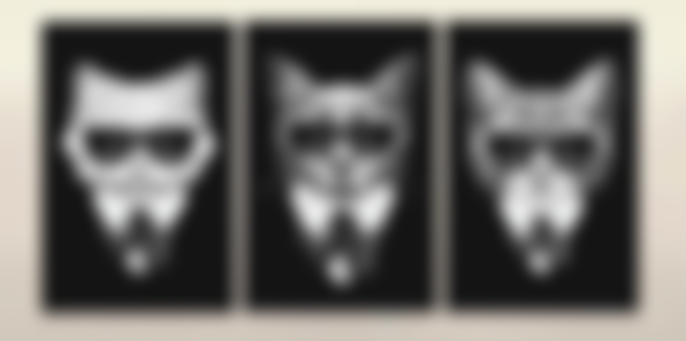
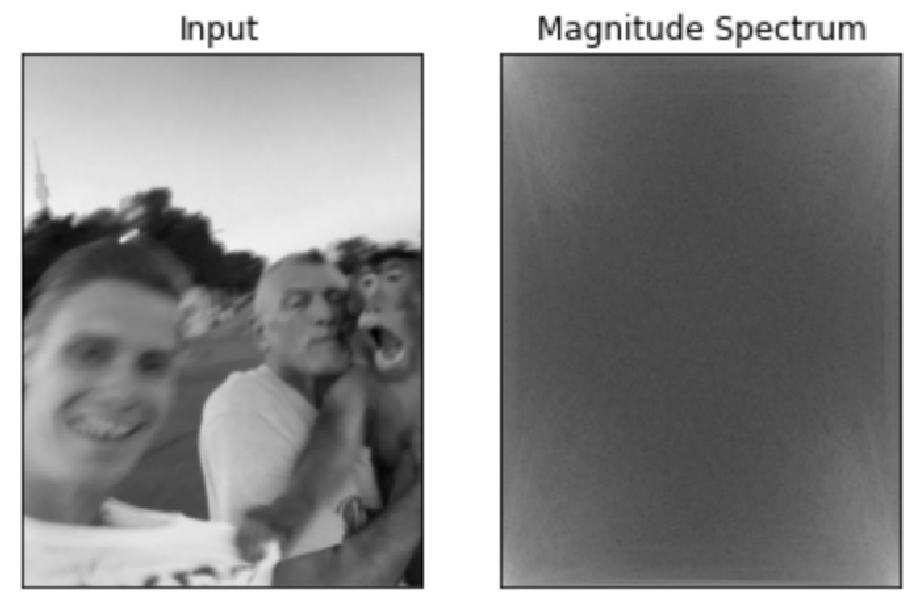
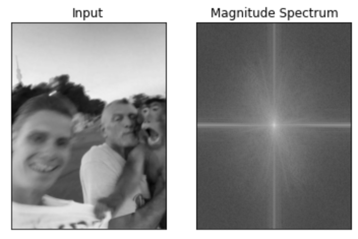
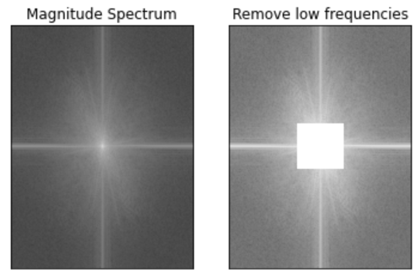
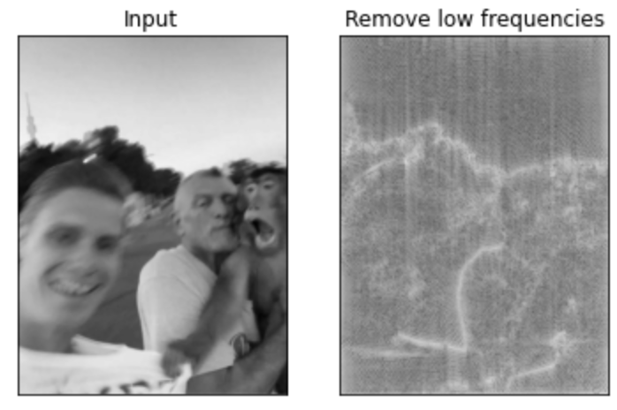
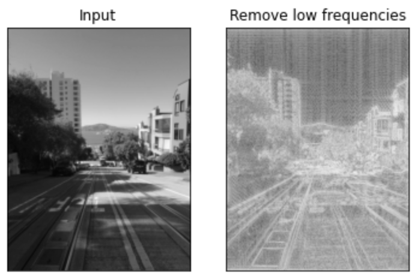

# Detecção de blur

## Transformada de Fourier
A transformada de Fourier é usada para decompor uma imagem nos seus componentes cosseno e seno (reais e imaginários) e passá-la do domínio espacial para o domínio de Fourier. No domínio de Fourier, cada pixel da imagem representa uma frequência particular que ela contém. 

### O que significam as frequências de uma imagem?
As frequências podem ser entendidas como a **taxa de mudança de intensidade por pixel**. De forma geral, podemos pensar numa foto como a mostrada abaixo 

A imagem acima possui linhas bem definidas e a mudança do quadro preto para a parede branca leva poucos pixels para ser concluida. Quanto **menos pixels essa mudança levar, maiores serão as frequências**. 

Por outro lado, quanto mais borrada a imagem, mais pixels serão necessários para observar essa mudança de padrões como é o caso da imagem abaixo.

Assim, quanto mais pixels forem necessários para efetuar essa variação de intensidade, menores serão as frequências quando a imagem for representada no domínio de Fourier.

Pensando nisso, é possível inferir se uma imagem está borrada ou não apenas verificando suas frequências no domínio de Fourier.

## Algoritmo

### 1. Aplicando FFT e encontrando o componente DC
Nessa implementação usaremos o algoritmo FFT (Fast Fourier Transform) que implementa a Transformada de Fourier Discreta, útil para análise de imagens **digitais**

Considerando uma imagem bidimensional N x N, a Transformada de Fourier Discreta (DFT) será aplicada como

 

Aqui, o  e o ponto (k, l) será definido como 

Após a aplicação da DFT (em termos de uma FFT para um resultado computacionalmente acelerado), teremos o *DC component* em F(0, 0). 

O componente DC pode ser definido como o "componente de frequência zero" e, em termos de imagem, é a representação do brilho médio. Além disso, temos que F(N-1, N-1) representa a maior frequência. 

A melhor maneira de analisar o espectro de magnitude de uma imagem é deslocando o componente DC para o centro e aplicando com o logarítmo. Como o componente DC é muito menor que os demais pontos, seria impossível construir o espectro de magnitude de forma visível sem o uso do logarítmo que é arbitrado conforme a expressão: 

A imagem abaixo, por exemplo, possui o componente DC (frequência zero) no centro e quanto mais distante do centro, mais altas serão as frequências. 

### 2. Removendo as baixas frequências

Podemos considerar que as frequências baixas contêm mais informações da imagem do que as altas e, ao removê-las, estamos removendo informação da imagem propriamente dita. De fato, a remoção das frequências baixas como sugerido corrompe a imagem original, mas o propósito aqui é avaliar o nível de nitidez da imagem e, para isso, precisamos focar na quantidade de altas frequências já que estas, como explicado anteriormente, são as responsáveis por guardar informações de bordas em geral.

Uma forma de remover as baixas frequências no que pode ser visto como uma aplicação grosseira do **filtro passa-altas** é zerar o centro da imagem onde estava colocado o componente DC.

### 3. Retornando para o domínio original

Após a remoção das baixas frequências, podemos deslocar o componente DC para F(0, 0) novamente e aplicar a Transformada Inversa de Fourier da forma 

 

A imagem resultante é reconstruida e os resultados abaixo mostram a diferença do que se pode ver das altas frequências em imagens borradas e imagens nítidas. Como pode ser observado, o resultado da segunda imagem (nítida) possui contornos bem mais bem definidos do que na primeira imagem (borrada).

Assim, ao remover as baixas frequências, permanecemos apenas com as informações de nitidez que necessitamos para avaliar a qualidade da imagem em relação aos níveis de borrado. Realizando a média aritmética dos valores de magnitude obtidos, veremos que imagens mais nítidas tendem a ter mais informações de bordas e, portanto, uma média de valores de altas frequências mais alta do que imagens borradas que possuem menos informações de bordas e uma média mais baixa de valores de altas frequências.
